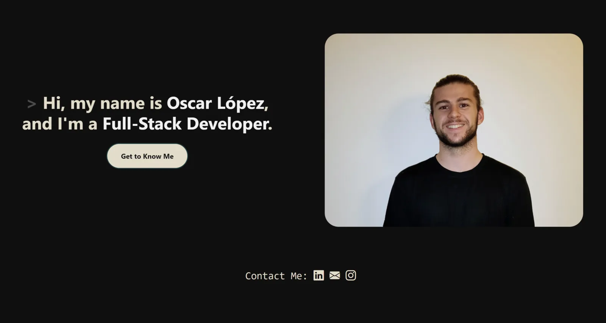

[English](README.md) · [Español](README.es.md)

# Oscar Lopez · Business Intelligence Developer

Portfolio personal de un BI Developer de Barcelona. Es un sitio estático escrito a mano: sin framework, sin build step y sin dependencias que instalar.

[](https://ocr99.github.io/portfolio/)
[](https://github.com/ocr99/portfolio/actions/workflows/pages.yml)
[](LICENSE)


**→ [ocr99.github.io/portfolio](https://ocr99.github.io/portfolio/)**



## Sobre mí

Diseño y desarrollo soluciones de Business Intelligence que convierten datos operativos en información fiable, cubriendo todo el camino desde la transformación y el modelado de datos hasta la lógica de KPIs, los modelos semánticos y la entrega final del dashboard. Trabajo sobre todo con **Power BI, Domo y SQL**, con experiencia en Power Query, Databricks y Azure Analysis Services.

- [LinkedIn](https://www.linkedin.com/in/oscarlopezconde/)
- [Agendar una llamada](https://cal.com/oscarlopez/30min)
- [CV (PDF)](assets/downloads/Oscar-Lopez-CV.pdf)

## Proyectos destacados

| Proyecto | Qué es | Stack |
|---|---|---|
| [Homelab](https://ocr99.github.io/portfolio/pages/projects/personal/homelab.html) | Infraestructura self-hosted funcionando desde 2021: virtualización, exposición segura sin abrir puertos, SSO propio y automatización del hogar | Proxmox VE · Docker · Caddy · Cloudflare Tunnel · LLDAP · Home Assistant |
| [El Bon Camí](https://ocr99.github.io/portfolio/pages/projects/elboncami.html) | E-commerce de alquiler de autocaravanas con reservas, pago con tarjeta y área de cliente | WordPress · WooCommerce · Elementor |
| [Este portfolio](https://ocr99.github.io/portfolio/pages/projects/personal/personal-portfolio.html) | La web que estás viendo, hecha desde cero | HTML · CSS · JavaScript · Bootstrap |

## Stack técnico

HTML, CSS y JavaScript planos. **No hay build step, y es a propósito**: para cinco páginas, un bundler daría más mantenimiento del que ahorra, y GitHub Pages puede desplegar el repositorio tal cual.

| Librería | Versión | Para qué |
|---|---|---|
| [Bootstrap](https://getbootstrap.com/) | 5.2.1 | Grid y clases de utilidad |
| [Bootstrap Icons](https://icons.getbootstrap.com/) | 1.9.1 | Iconos |
| [AOS](https://michalsnik.github.io/aos/) | 2.3.4 | Animaciones al hacer scroll |
| [GLightbox](https://biati-digital.github.io/glightbox/) | 3.3.1 | Páginas de proyecto en overlay |
| [Swiper](https://swiperjs.com/) | 8.4.7 | Sliders de capturas de proyecto |

Todo se carga por CDN con versión exacta y hash de Subresource Integrity. Cada página carga solo lo que usa de verdad.

Los estilos son CSS plano con custom properties. Todo el sitio funciona con una paleta de cuatro colores declarada una sola vez en `:root`:

```css
--maincolor: #100F0F;     /* fondo                    */
--accentcolor: #0F3D3E;   /* tarjetas, nav, bordes    */
--textcolor: #E2DCC8;     /* texto                    */
--contrastcolor: #F1F1F1; /* resaltados               */
```

## Estructura del proyecto

```
.
├── index.html                  Portada
├── 404.html                    Lo sirve Pages para rutas inexistentes
├── robots.txt
├── sitemap.xml                 Se mantiene a mano
├── assets/
│   ├── styles.css              Todos los estilos
│   ├── main.js                 Todo el comportamiento
│   ├── site.webmanifest        Manifest de la PWA
│   ├── img/                    Capturas y retrato en WebP
│   ├── favicon/
│   └── downloads/              CV
├── pages/
│   ├── aboutme.html            La página principal: sobre mí, stack, experiencia, proyectos, contacto
│   └── projects/
│       ├── elboncami.html
│       └── personal/
│           ├── homelab.html
│           └── personal-portfolio.html
└── .github/workflows/pages.yml Deploy a GitHub Pages
```

## Levantarlo en local

Hay que servirlo por HTTP, no abrir los archivos directamente. Con `file://` el manifest y algunas rutas relativas no se comportan igual.

Lo más cómodo es la extensión [Live Server](https://marketplace.visualstudio.com/items?itemName=ritwickdey.LiveServer) de VS Code: clic derecho en `index.html` y *Open with Live Server*.

Si tienes Python o Node a mano:

```bash
python -m http.server 8000   # y abre http://localhost:8000
npx serve                    # o esto
```

## Añadir un proyecto nuevo

1. Copia una página de proyecto existente, por ejemplo `pages/projects/personal/homelab.html`.
2. Actualiza su `<head>`: título, descripción, keywords, canonical, Open Graph y el bloque JSON-LD.
3. Revisa la profundidad de las rutas de assets y del enlace *Back to portfolio*. Las páginas bajo `projects/personal/` necesitan `../../`, las que están en `projects/` necesitan `../`.
4. Añade una tarjeta a la sección `#portfolio` de `pages/aboutme.html`.
5. Añade una entrada `<url>` al `sitemap.xml` con la fecha de hoy en `<lastmod>`.

## Despliegue

Hacer push a `master` dispara [`.github/workflows/pages.yml`](.github/workflows/pages.yml), que sube el repositorio tal cual y lo despliega en GitHub Pages. No hay fase de build, así que lo que se commitea es exactamente lo que se sirve.

## Notas de implementación

Algunas cosas que no se ven leyendo el código:

- **Los años se actualizan solos.** Cualquier elemento con `data-years-since="YYYY-MM-DD"` sustituye su texto por `"N+ years"`, calculado en hora de Madrid. Con `data-years-exact` se quita el `+`. Los años de experiencia del sitio nunca se editan a mano.
- **El email se inyecta en tiempo de ejecución.** No está en el HTML. `main.js` rellena el href de cada `a.mailto` y escribe la dirección como texto en cualquier `.mailto-text` anidado. Los anchors con `.noTextA` conservan su propio contenido.
- **Las páginas de proyecto se abren de dos formas.** Desde el grid de proyectos cargan dentro de un overlay de GLightbox; desde un resultado de Google cargan solas. Por eso el enlace *Back to portfolio* usa `target="_top"`, para salir del overlay en vez de navegar dentro de él.
- **`sitemap.xml` es manual.** Actualiza el `<lastmod>` correspondiente cuando cambies una página.
- **Hay CSS que parece muerto y no lo está.** Las reglas de `.resume .mycv` y `.resume .modal` dan estilo al botón y al modal del CV, cuyo HTML está comentado ahora mismo en `pages/aboutme.html`. Se conservan para que descomentarlo devuelva un modal funcionando.

## Licencia

[GNU GPL v3](LICENSE)
