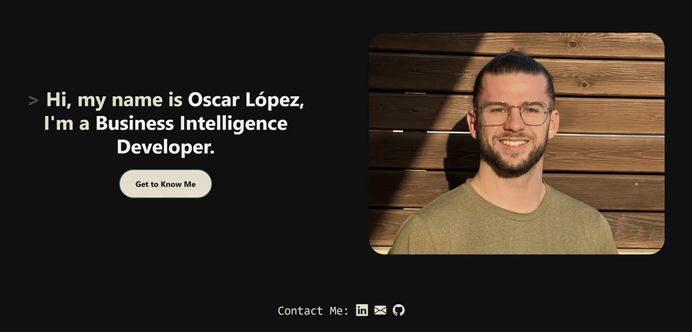

[English](README.md) · [Español](README.es.md)

# Oscar Lopez's Web Portfolio

My personal portfolio, built as a static page in HTML, CSS and JS exclusively. No framework, no build step, no dependencies to install.

[](https://ocr99.github.io/portfolio/)
[](https://github.com/ocr99/portfolio/actions/workflows/pages.yml)
[](LICENSE)


**→ [ocr99.github.io/portfolio](https://ocr99.github.io/portfolio/)**



## About me

I'm a Business Intelligence Developer in Barcelona. I build reporting solutions end to end, from data transformation and modelling to KPI logic and the final dashboard, mostly with **Power BI, Domo and SQL**.

- [LinkedIn](https://www.linkedin.com/in/oscarlopezconde/)
- [Schedule a call](https://cal.com/oscarlopez/30min)
- CV: [English](https://rxresu.me/oscarlopez/cv-english) · [Español](https://rxresu.me/oscarlopez/cv-espanol)

## Portfolio

### Homelab
> Self-hosted infrastructure I've run since 2021, with `Proxmox VE`, `Docker`, `Caddy`, `Cloudflare Tunnel`, `LLDAP` and `Home Assistant`
- [Homelab](https://ocr99.github.io/portfolio/pages/projects/personal/homelab.html)

### El Bon Camí
> Rental RV page created with `WordPress`, `Woocommerce` and `Elementor`
- [El Bon Camí](https://www.elboncami.com/)

### The portfolio itself
> Portfolio web to show resume online
- [Personal Web Portfolio](https://ocr99.github.io/portfolio/)

## Tech stack

> Languages used: `HTML`, `CSS` and `JavaScript`

| Library | Version | Used for |
|---|---|---|
| Bootstrap | 5.2.1 | Grid and utility classes |
| Bootstrap Icons | 1.9.1 | Icons |
| AOS | 2.3.4 | Animate on scroll |
| GLightbox | 3.3.1 | Project pages in an overlay |
| Swiper | 8.4.7 | Screenshot sliders |

All of it loads from CDN, pinned to an exact version and with an SRI hash. Each page only pulls in what it actually uses.

Styling is plain CSS with custom properties. The whole site runs on four colours:

```css
--maincolor: #100F0F;     /* background          */
--accentcolor: #0F3D3E;   /* cards, nav, borders */
--textcolor: #E2DCC8;     /* text                */
--contrastcolor: #F1F1F1; /* highlights          */
```

## Structure

```
.
├── index.html                  Landing page
├── 404.html
├── robots.txt
├── sitemap.xml
├── assets/
│   ├── styles.css              All the styling
│   ├── main.js                 All the behaviour
│   ├── site.webmanifest
│   ├── img/                    WebP screenshots and headshot
│   ├── favicon/
│   └── downloads/              CV in both languages
├── pages/
│   ├── aboutme.html            The main one: about, stack, experience, projects, contact
│   └── projects/
│       ├── elboncami.html
│       └── personal/
│           ├── homelab.html
│           └── personal-portfolio.html
└── .github/workflows/pages.yml
```

## Deployment

Push to `master` and [the workflow](.github/workflows/pages.yml) uploads the repo as-is to GitHub Pages. Nothing gets built, so what I commit is what gets served.

## License

[GNU GPL v3](LICENSE)
